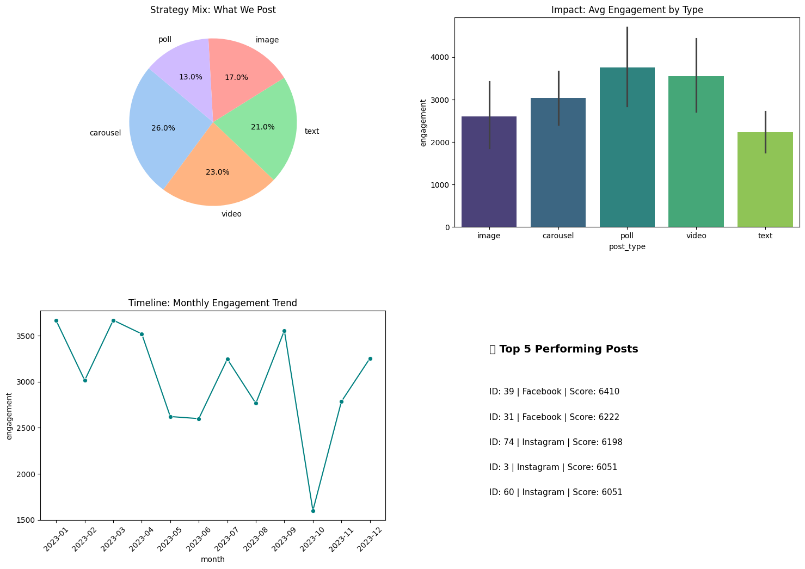
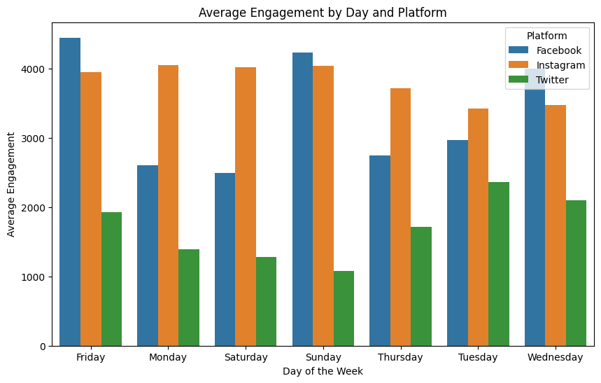
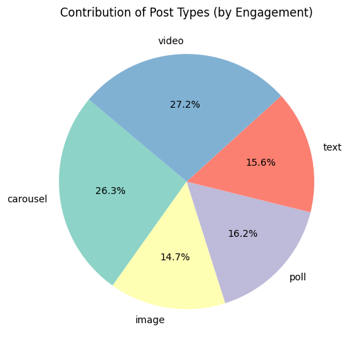
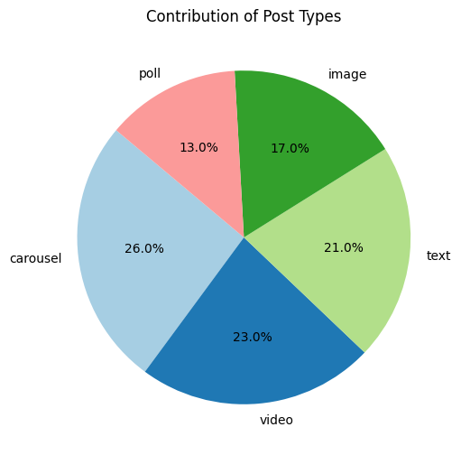
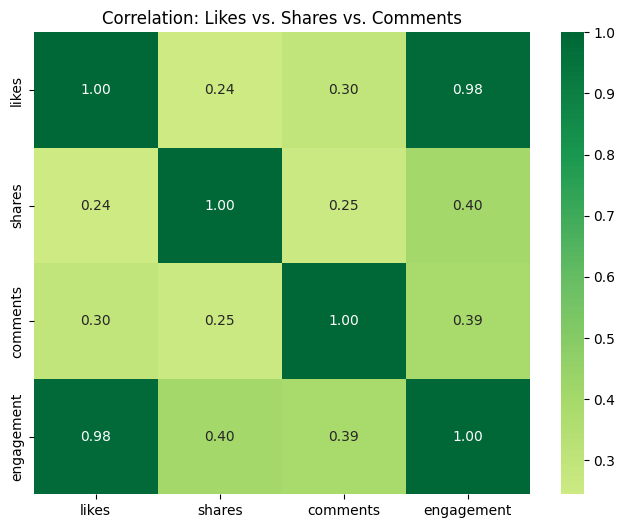
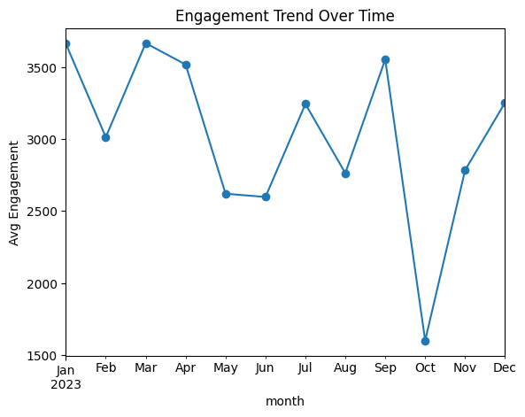
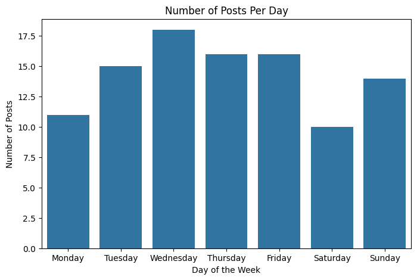
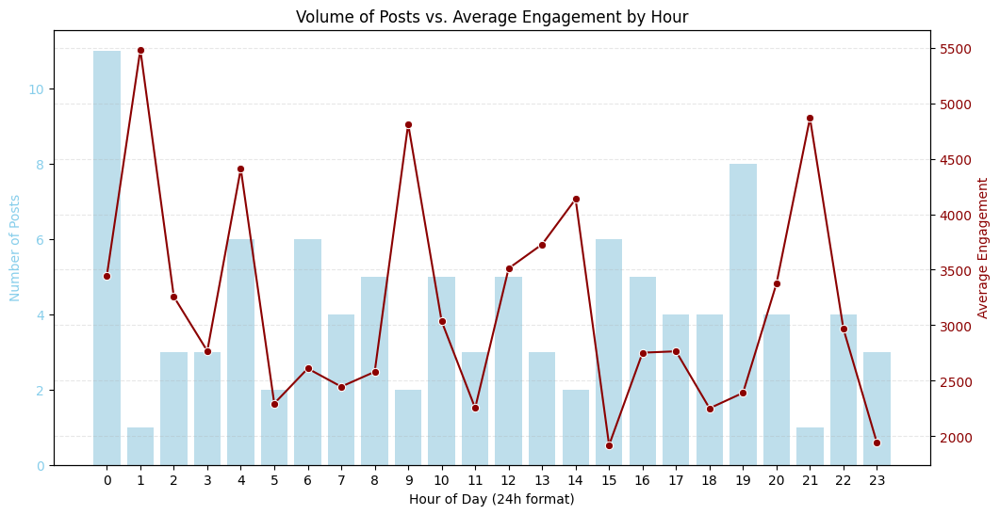

# 📊 Social Media Sentiment & Engagement Analysis

A modular Python pipeline for loading, cleaning, and visualising social media engagement data across platforms, post types, and time periods.

---

## 📁 Project Structure

```
socialmedia_sentiment_engagement_analysis_machine_learning/
├── src/
│   ├── analysis.py                    # Optimized modular pipeline
│   └── socialmediadataanalysis.py     # Original notebook reference
├── assets/                            # Chart images
├── requirements.txt
├── .gitignore
└── README.md
```

---

## 🚀 Quick Start

### 1. Clone the repository
```bash
git clone https://github.com/dipanburja/socialmedia_sentiment_engagement_analysis_machine_learning.git
cd socialmedia_sentiment_engagement_analysis_machine_learning
```

### 2. Create a virtual environment
```bash
python -m venv venv
source venv/bin/activate        # macOS / Linux
venv\Scripts\activate           # Windows
```

### 3. Install dependencies
```bash
pip install -r requirements.txt
```

### 4. Run the pipeline
```bash
python src/analysis.py social_media_engagement.csv
```

---

## 📊 Sample Output Charts

### 🏆 Executive Dashboard — All Summary Report


### 🌐 Average Engagement by Platform


### 📅 Average Engagement by Day and Platform


### 💬 Average Engagement by Sentiment Type


### 🥧 Contribution of Post Types (by Engagement)


### 🥧 Contribution of Post Types (by Volume)


### 🔗 Correlation Between Post Engagement


### 📈 Engagement Trend Over Month


### 📆 Number of Posts Per Day


### 📦 Engagement Distribution by Post Type


### 🕐 Volume of Posts vs. Average Engagement by Hour


---

## 📦 Dataset Format

| Column | Type | Description |
|---|---|---|
| `post_id` | string/int | Unique post identifier |
| `platform` | string | e.g. `Facebook`, `Instagram`, `Twitter` |
| `post_type` | string | e.g. `image`, `video`, `text`, `carousel`, `poll` |
| `post_day` | string | Day name, e.g. `Monday` |
| `post_time` | datetime | Full timestamp |
| `likes` | int | Like count |
| `comments` | int | Comment count |
| `shares` | int | Share count |
| `sentiment_score` | string | `positive`, `neutral`, or `negative` |

---

## 🔑 Key Findings

- **Instagram** drives the highest average engagement (42.2%)
- **Polls and videos** outperform other post types
- **1 AM and 9 PM** are peak engagement hours
- **Negative sentiment** posts receive slightly higher engagement than positive ones
- **Wednesday and Friday** generate the most total interactions
- **Likes** have a very strong correlation (0.98) with overall engagement

---

## 🛠 Tech Stack

- **pandas** – data wrangling
- **NumPy** – numerical operations
- **Matplotlib / Seaborn** – visualisation
- **scikit-learn** – ML extensions

---

## 📄 License

MIT License — feel free to use, modify, and share.